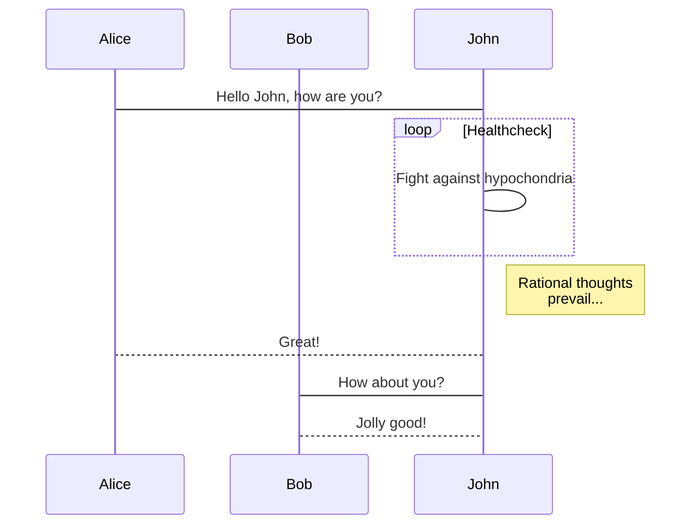
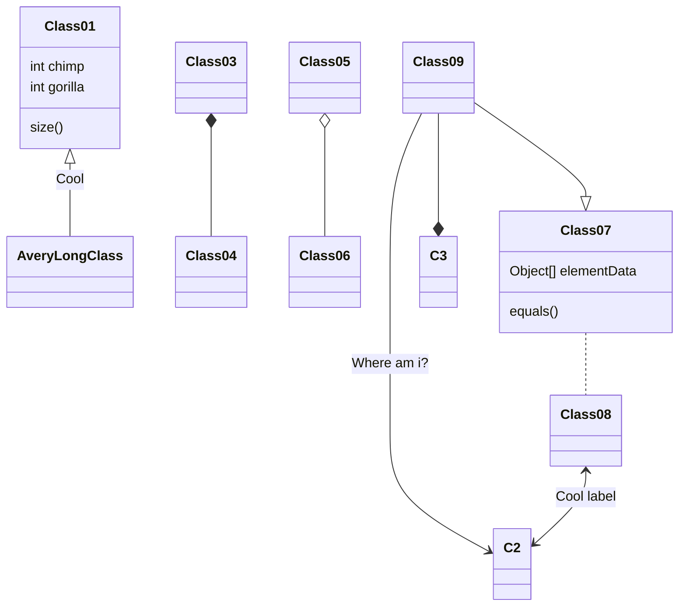
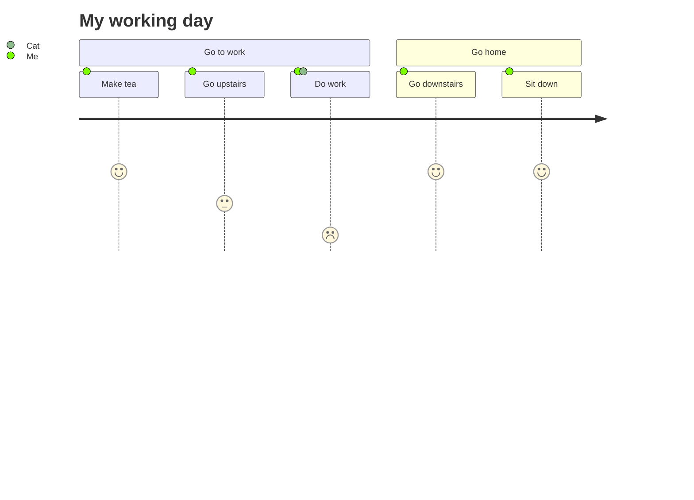
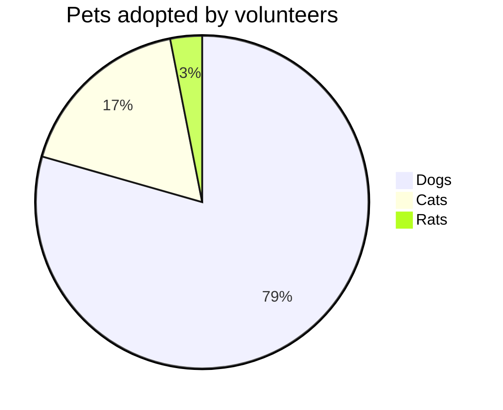

# markdown-it-vue

## Image size and Viewer


## GitHub Table of Contents

[[toc]]

Note: Only `h2` and `h3` are shown in toc.

<h1>I'm H4</h1>

<div style="text-align: center">
Et id ut quis et beatae. Qui similique sapiente rerum. Nesciunt in dignissimos ea et maiores sunt. Suscipit molestiae id veritatis et earum nemo.
</div>

## Katex

First 

$$\sum_{i=1}^n a_i=0$$

$$
\frac{1}{\Bigl(\sqrt{\phi \sqrt{5}}-\phi\Bigr) e^{\frac25 \pi}} = 1+\frac{e^{-2\pi}} {1+\frac{e^{-4\pi}} {1+\frac{e^{-6\pi}} {1+\frac{e^{-8\pi}} {1+\cdots} } } }
$$

second 

$$ f(x) = \int_{-\infty}^\infty\hat f(\xi)\,e^{2 \pi i \xi x}\,d\xi $$

Third

$$
1 +  \frac{q^2}{(1-q)}+\frac{q^6}{(1-q)(1-q^2)}+\cdots = \prod_{j=0}^{\infty}\frac{1}{(1-q^{5j+2})(1-q^{5j+3})}, \quad\quad \text{for }\lvert q\rvert<1.
$$

## alter

Markup is similar to fenced code blocks. Valid container types are `success`, `info`, `warning` and `error`.

::: tip Hello
You have got it.
:::

::: details info
You have new mail.
:::

::: warning HEYYY
You have new mail.
:::

::: danger TAKE CARE
Staying up all night is bad for health.
:::

## mermaid charts

### mermaid Flowchart

[Flowchart Syntax](http://knsv.github.io/mermaid/#flowcharts-basic-syntax)










## Definition list

Term 1
  ~ Definition 1

Term 2
  ~ Definition 2a
  ~ Definition 2b

[Definition List Syntax](http://pandoc.org/README.html#definition-lists)


## AsciiMath

Inline AsciiMath: `@(1/2[1-(1/2)^n])/(1-(1/2))=s_n@`

```AsciiMath
oint_Cx^3 dx+4y^2 dy

2=(((3-x)xx2)/(3-x))

sum_(m=1)^oosum_(n=1)^oo(m^2 n)/(3^m(m3^n+n3^m)
```

```ASCIIMath
phi_n(kappa) = 1/(4pi^2 kappa^2)
 int_0^oo (sin(kappa R))/(kappa R)
 del/(del R)
[R^2 (del D_n (R))/(del R)] del R
```

[AsciiMath Documentation](http://asciimath.org/)

## Subscript: H~2~O

You can also use inline math: `$H_2O$`


## Superscript: 29^th^

You can also use inline math: `$29^{th}$`


## Emoji: :panda_face: :sparkles: :camel: :boom: :pig:

[Emoji Cheat Sheet](http://www.emoji-cheat-sheet.com/)

## Fontawesome: :fa-car: :fa-flag: :fa-bicycle: :fa-leaf: :fa-heart:

[All the Font Awesome icons](http://fontawesome.io/icons/)

## Echarts

[Documentation for Echarts](http://echarts.baidu.com)

The width and height is the size for chart container.

```echarts
{
  "width": 500,
  "height": 400,
  "series": [
    {
      "name": "访问来源",
      "type": "pie",
      "radius": "55%",
      "data": [
        {
          "value": 235,
          "name": "视频广告"
        },
        {
          "value": 274,
          "name": "联盟广告"
        },
        {
          "value": 310,
          "name": "邮件营销"
        },
        {
          "value": 335,
          "name": "直接访问"
        },
        {
          "value": 400,
          "name": "搜索引擎"
        }
      ]
    }
  ]
}
```

## code

### c
```c
#include <stdio.h>
int main(int argc char* argv[]) {
  printf("Hello, World!");
  return 0;
}
```

### json

```json
{
  "name": "markdown-it-vue"
}
```

### javascript
```json
import MarkdownItVue from 'markdown-it-vue'
export default {
  components: {
    MarkdownItVue
  }
}
```

### bash
```bash
npm install markdown-it-vue
```

## table

| First Header  | Second Header |
| ------------- | ------------- |
| Content Cell  | Content Cell  |
| Content Cell  | Content Cell  |

## flowchart.js

```flowchart.js
st=>start: Start|past:>http://duckduckgo.com[blank]
e=>end: End:>http://duckduckgo.com
op1=>operation: My Operation|past
op2=>operation: Stuff|current
sub1=>subroutine: My Subroutine|invalid
cond=>condition: Yes
or No?|approved:>http://duckduckgo.com
c2=>condition: Good idea|rejected
io=>inputoutput: catch something...|request
para=>parallel: parallel tasks

st->op1(right)->cond
cond(yes, right)->c2
cond(no)->para
c2(true)->io->e
c2(false)->e

para(path1, bottom)->sub1(left)->op1
para(path2, right)->op2->e

st@>op1({"stroke":"Red"})@>cond({"stroke":"Red","stroke-width":6,"arrow-end":"classic-wide-long"})@>c2({"stroke":"Red"})@>op2({"stroke":"Red"})@>e({"stroke":"Red"})
```

