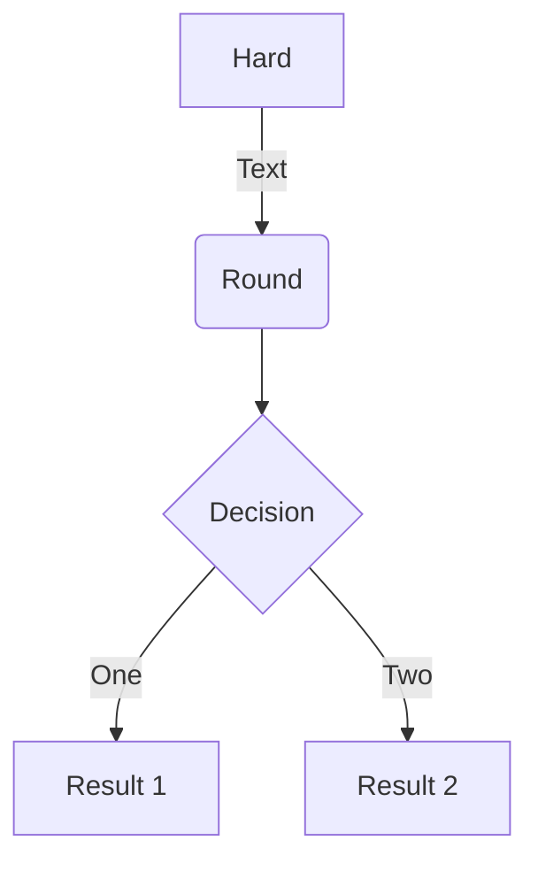
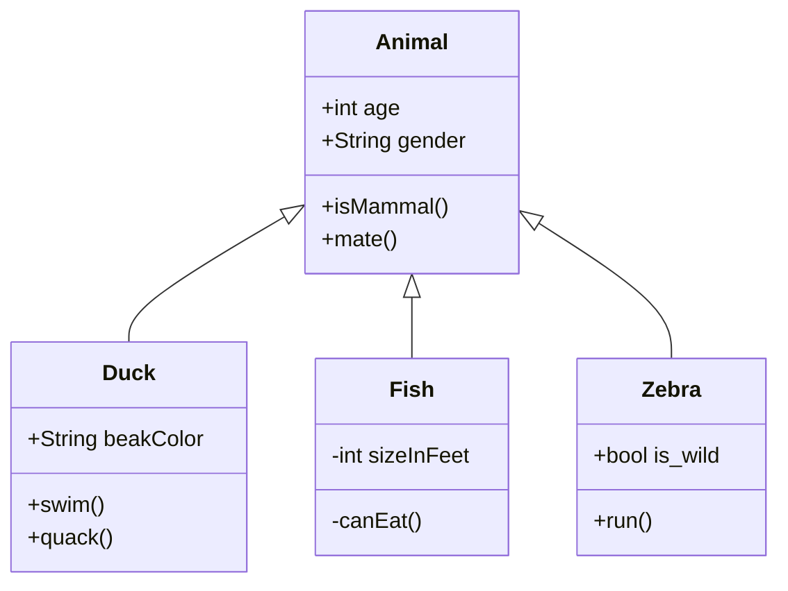

## Formatting

_Italic_

*Italic*

__Bold__

**Bold**

~~Strikethrough~~

Subscript~example~

Superscript^example^

## Lists

- [ ] Unchecked task
- [x] Checked task
- [ ] Nested
	- [x] Checked
	- [ ] Task

## Charts

Graph

Class

<h3> a title here </h3>

HELLO

## Tables

#### Regular

| Tables | Are | Great |
| ------ | --- | ----- |
| •      | •   | •     |
| •      | •   | •     |

#### Aligned

| Left | Center | Right |
| :--- | :----: | ----: |
| •    | •      | •     |

